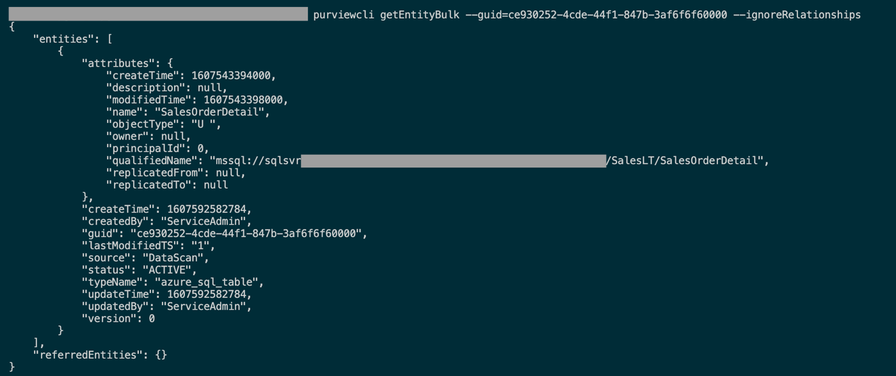

# Azure Purview CLI

This package provides a command line interface to Azure Purview's REST API.  


## Getting Started

[Getting Started](./doc/md/guide.md) - how to install, setup, and use purviewcli.

## Installation

```
pip install purviewcli
```

## Usage

```
pv command sub-command --parameter1='value' --parameter2='value'
```

## Parameter Types

* All parameters are required by default.
* Parameters enclosed with square brackets "**[ ]**" are optional.
* Mutually exclusive parameters are enclosed with parens "**( )**" and separated with a pipe "**|**".
* The "=&lt;val&gt;" indicates parameters which require an input (e.g. --parameter=&lt;val&gt;). Input can be specified after a space (e.g. --parameter 'value') or equal "**=**" sign (e.g. --parameter='value').
* Parameters that do not require an input are **False** by default and **True** if present (e.g. --ignoreRelationships).
* The ellipsis "**...**" indicates parameters that are allowed to repeat (e.g. --guid='12345' --guid='23451' --guid='34512')

## Command Reference

Control Plane (Azure Resource Manager)
* [pv management](./doc/commands/management/main.md)

Data Plane (Apache Atlas)
* [pv entity](./doc/commands/entity/main.md)
* [pv glossary](./doc/commands/glossary/main.md)
* [pv lineage](./doc/commands/lineage/main.md)
* [pv relationship](./doc/commands/relationship/main.md)
* [pv types](./doc/commands/types/main.md)

Data Plane (Other)
* [pv account](./doc/commands/account/main.md)
* [pv insight](./doc/commands/insight/main.md)
* [pv policystore](./doc/commands/policystore/main.md)
* [pv scan](./doc/commands/scan/main.md)
* [pv search](./doc/commands/search/main.md)