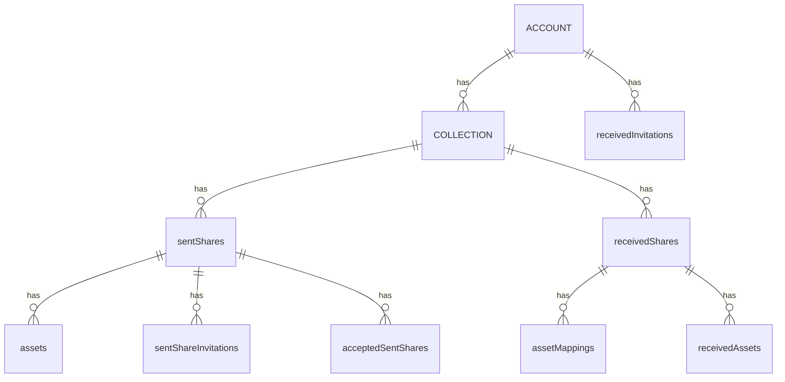
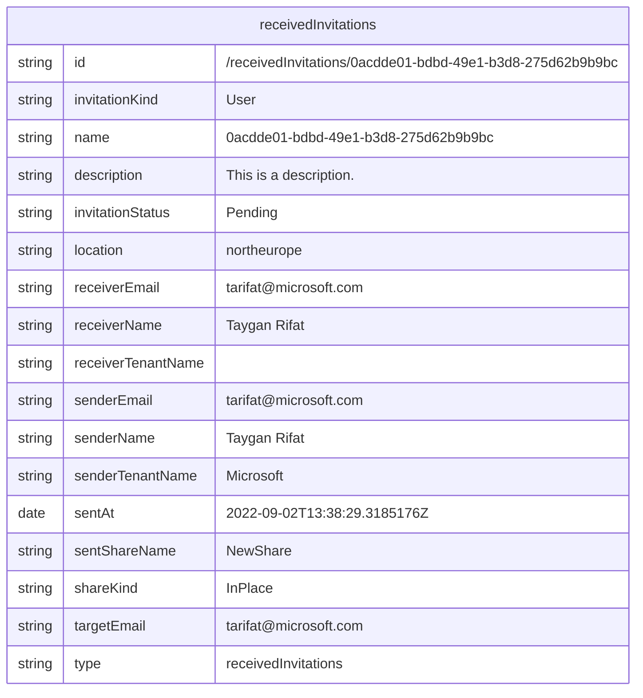

# Share
[Command Reference](../../../README.md#command-reference) > share

## Sent Shares
| Command | Description |
| --- | --- |
| [pv share listSentShares](./listSentShares.md) | Get list of sent shares in the given Purview account. |
| [pv share createSentShare](./createSentShare.md) | Create a sent share in the given Purview account. |
| [pv share deleteSentShare](./deleteSentShare.md) | Deletes a sent share. |
| [pv share getSentShare](./getSentShare.md) | Get a sent share in the given Purview account. |

## Accepted Sent Shares
| Command | Description |
| --- | --- |
| [pv share listAcceptedShares](./listAcceptedShares.md) | List of accepted shares for the current sent share. |
| [pv share getAcceptedShare](./getAcceptedShare.md) | Get an accepted share with acceptedSentShareName to a particular sent share. |
| [pv share reinstateAcceptedShare](./reinstateAcceptedShare.md) | Reinstate a revoked accepted sent share. |
| [pv share revokeAcceptedShare](./revokeAcceptedShare.md) | Revoke an accepted sent share's access. |
| [pv share updateExpirationAcceptedShare](./updateExpirationAcceptedShare.md) | Update the expiration date of an active accepted sent share. |

## Sent Invitations
| Command | Description |
| --- | --- |
| [pv share listSentInvitations](./listSentInvitations.md) | List all Invitations in a share. |
| [pv share createSentInvitation](./createSentInvitation.md) | Create/Update a sent share invitation in the given account. |
| [pv share deleteSentInvitation](./deleteSentInvitation.md) | Delete Invitation in a share. |
| [pv share getSentInvitation](./getSentInvitation.md) | Get Invitation for a given share. |

## Received Shares
| Command | Description |
| --- | --- |
| [pv share listReceivedShares](./listReceivedShares.md) | Get a list of received shares. |
| [pv share createReceivedShare](./createReceivedShare.md) | Create a received share in the given account. |
| [pv share deleteReceivedShare](./deleteReceivedShare.md) | Deletes a received share. |
| [pv share getReceivedShare](./getReceivedShare.md) | Get a received share by name. |

## Received Invitations
| Command | Description |
| --- | --- |
| [pv share listReceivedInvitations](./listReceivedInvitations.md) | Lists the received invitations. |
| [pv share getReceivedInvitation](./getReceivedInvitation.md) | Gets the received invitation identified by name. |
| [pv share rejectReceivedInvitation](./rejectReceivedInvitation.md) | Rejects the received invitation identified by name. |

## Asset Mappings
| Command | Description |
| --- | --- |
| [pv share listAssetMappings](./listAssetMappings.md) | List AssetMappings in a received share. |
| [pv share createAssetMapping](./createAssetMapping.md) | Maps a source asset in the sent share to a destination asset in the received share. |
| [pv share deleteAssetMapping](./deleteAssetMapping.md) | Delete AssetMapping in a receivedShare. |
| [pv share getAssetMapping](./getAssetMapping.md) | Get AssetMapping in a receivedShare. |

## Assets
| Command | Description |
| --- | --- |
| [pv share listAssets](./listAssets.md) | List Assets in a share. |
| [pv share createAsset](./createAsset.md) | Adds a new asset to an existing share. |
| [pv share deleteAsset](./deleteAsset.md) | Delete asset in a sentShare. |
| [pv share getAsset](./getAsset.md) | Get asset in a sentShare. |
| [pv share listReceivedAssets](./listReceivedAssets.md) | List source asset of a received share. |

## Email Registration
| Command | Description |
| --- | --- |
| [pv share activateEmail](./activateEmail.md) | Activates the tenant and email combination using the activation code received. |
| [pv share registerEmail](./registerEmail.md) | Registers the tenant and email combination for activation. |

## ER Diagram

