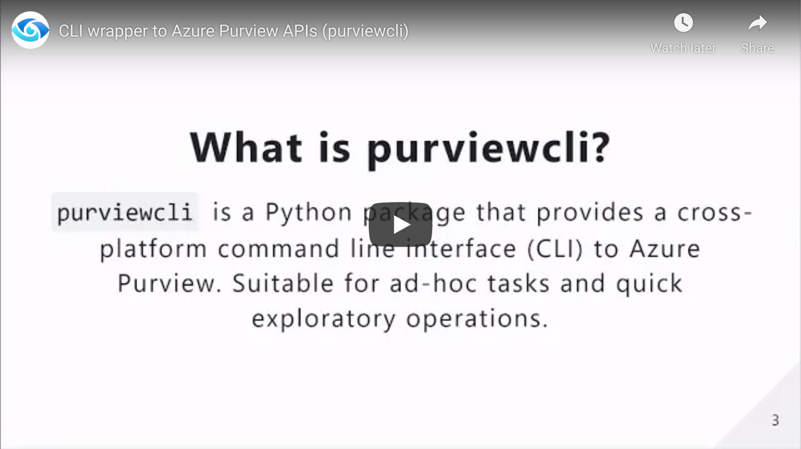

## Getting Started

[Home](../../README.md) > Getting Started

## Overview

[](https://www.youtube.com/watch?v=ycr1G5iMM6U)

## Requirements

The purviewcli package works on Python versions:

* Python 3.6+
* Python 3.7+
* Python 3.8+
* Python 3.9+

## Local Installation

```
pip install purviewcli
```

## Run container on Docker Desktop (Alternative)

Alternatively, you can run Purview CLI inside a self-enclosed Docker Container.

1. Build container image locally.
```
docker build -t purviewcli https://raw.githubusercontent.com/tayganr/purviewcli/master/docker/Dockerfile
```

2. Start container by injecting environment variables. Note: You will need to update the environment variables.
```
docker run --name purview-cli-docker -d -e "PURVIEW_NAME=<your_purview_account_name>" -e "AZURE_CLIENT_ID=<your_client_id>" -e "AZURE_CLIENT_SECRET=<your_client_secret>" -e "AZURE_TENANT_ID=<your_azure_tenant_id>" purviewcli
```

3. Start a bash shell in the container.
```
docker exec -it purview-cli-docker bash
```

## Quick Start

1. Install purviewcli (e.g. `pip install purviewcli`).
2. [OPTIONAL] Set environment variable(s).
    *  `PURVIEW_NAME`
    * `AZURE_CLIENT_ID`
    * `AZURE_TENANT_ID`
    * `AZURE_CLIENT_SECRET`

   Note #1: The environment variables related to authentication are optional as there are several methods in which we can pass credentials to purviewcli in order to authenticate with an instance of Azure Purview. See [Authentication](#authentication) for more details. 

   Note #2: While an Azure Purview account name ***must*** be specified, you can provide this value within the command itself (as opposed to via an environment variable). Simply add `--purviewName=<val>` at the end of any command.

3. Execute a command (e.g. `pv glossary read --purviewName PURVIEW_ACCOUNT_NAME`).

Snippet of an example Python-based notebook below.  
Note: If you are executing purviewcli commands within a Python notebook, you will need to prefix the command with an exclamation mark `!`. This will ensure the command is passed to the shell (not the Python interpreter).


## Authentication

The purviewcli package leverages the `DefaultAzureCredential` method from [azure-identity](https://github.com/Azure/azure-sdk-for-python/tree/master/sdk/identity/azure-identity#defaultazurecredential). This provides purviewcli a variety of credential sources it can use to attempt authentication (e.g. Environment Variables, Managed Identity, Visual Studio Code, Azure CLI, Interactive). For example, if you are signed into Azure within Visual Studio Code, purviewcli will leverage those existing credentials when executing a command. This negates the need to store and manage credentials specific to the purviewcli package by leveraging what exists already. Read the [azure-identity](https://github.com/Azure/azure-sdk-for-python/tree/master/sdk/identity/azure-identity#defaultazurecredential) documentation to understand the authentication hierarchy.

## Authorization

The identity executing Azure Purview CLI commands will need the following role assignments:  

* `Data Curator` (read/write on catalog objects)
* `Data Source Admin` (read/write on sources/scans)
* `Collection Admin` (assign roles/manage collections)

For more information, check out [Access control in Azure Purview](https://docs.microsoft.com/en-us/azure/purview/catalog-permissions).